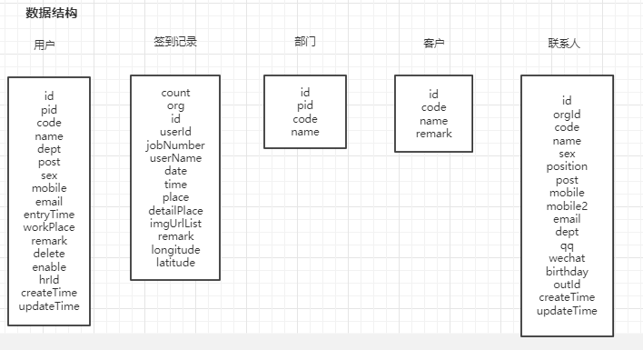

## 签到钉钉小程序开发文档 v2.0

Author: steven Date: 2020-12-15 Version：2.0.0

#### 一、需求分析


核心业务：用户进入小程序，在首页查看相关信息，如果觉得地址定位不准，可以点击地址微调进入地址微调页面，选择其他地址，需要选择客户可以点击选择客户进入客户选择页面选择客户，信息确定后可以点击签到进入签到提交页面，在签到提交页面可以进行拍照（最多9张），和填写备注信息，所有信息确认无误后，可以点击提交进行签到，签到成功后，会跳转到当前签到信息的签到详情页，地图展示签到定位。（图上蓝色背景）

辅助业务：用户进入小程序，点击tabbar上的统计进入统计页面，在统计页面可以查看当前部门当天签到状况，点击未签到可以查看未签到具体人员，如果要查看其他下属部门，可以点击部门进行选择，如果要查看其他日期，可以点击日期进行选择。点击历史分布可以查看当前选择人员当天的签到历史分布，点击签到信息列表项目可以进入对应人员的我的页面，在我的页面可以查看到当月的签到信息，如需查看其他月份签到信息，可以点击月份进行选择，点击签到信息列表项目可以进入对应的签到信息的签到详情页，查看签到详情信息（地图展示签到定位）。

#### 二、页面结构


#### 三、功能点


1. 首页
   1. 顶部显示当前日期，当前企业
   2. 显示当前定位地址，地图显示当前定位点，点击 **地点微调** 或者 **地图** 进入 地点微调页面。
   3. 显示当前选择拜访客户，如未选择则显示 **请选择拜访客户** ，点击 **请选择拜访客户** 文字 或者 **选择** 图标，进入选择客户页。签到成功后返回，选择客户置空。
   4. 显示 **签到** 按钮，按钮内显示当前进入时间，签到成功后返回，刷新为当前时间。
   5. 显示今日签到次数，如没有签到，显示文字 **今日你还没有签到**，已签到就显示，**今日你已签到1次** 。
2.  地点微调页
  
   1. 顶部显示搜索框，可以搜索当前定位周边地址，确认按钮返回首页。
   2. 地图显示当前定位点和选择地址定位点，回到定位点图标。
   3. 列表显示周边地址，点击项目可以选中项目。
3. 选择客户页
1. 顶部显示搜索框，可以搜索用户所属客户。
  2. 列表显示客户信息，右边倒三角点击可以展开联系人信息。点击客户或者联系人可以选择客户并返回首页。
4. 签到提交页
   1. 顶部显示签到时间，签到地点，拜访对象（如试用期等不选客户则不显示）。
   2. 文本框可以输入备注信息，点击相机图标可以拍照（最多9张）。
   3. 显示当前企业名称 ，显示签到信息可见范围。
   4. 提交按钮可以提交签到信息到后台服务器。


5. 签到详情页
   1. 地图显示签到定位点
   2. 信息卡展示签到信息（签到日期，签到时间，拜访对象，签到地点，签到地址，签到备注，签到图片），注：签到备注，签到图片和拜访对象如无则不显示。
6. 统计页
   1. 顶部显示签到信息部门范围，日期，点击部门可以选择人员，点击日期可以选择日期。点击 **签到历史分布** 可以进入签到地点分布页。
   2. 统计区域显示已签到数和未签到数，点击未签到可以查看未签到人员。
   3. 列表显示签到信息，点击列表项目可以进入 **我的** 页面。
7. 我的
   1. 顶部显示月份信息，点击可以选择其他月份。显示用户信息，签到总次数，公司信息。点击 **签到历史分布** 可以进入签到历史分布页面。
   2. 列表显示签到信息，点击项目可以进入签到详情页面。

#### 三、数据结构



用户

```tsx
export interface IUserDetail {
  id?: number
  pid?: number
  code?: string
  name?: string
  dept?: IDept
  post?: string
  sex?: string
  mobile?: string
  email?: string
  entryTime?: string
  workPlace?: string
  remark?: string
  delete?: boolean
  enable?: boolean
  hrId?: number
  createTime?: string
  updateTime?: string
}
```

签到记录

```tsx
export interface IUserSignVO {
  count: number
  org: IOrgVO
  id: string
  userId: number
  jobNumber: string
  userName: string
  date: string
  time: string
  place: string
  detailPlace: string
  imgUrlList: string[]
  remark: string
  longitude: string
  latitude: string
}
export interface IOrgVO {
  id: number
  name: string
}
```

部门

```tsx
export interface IDept {
  id: number
  pid: number
  code: string
  name: string
}
```

客户

```tsx
export interface IOrgGroup {
  id: number
  code: string
  name: string
  remark: string
}
```

联系人

```tsx
export interface ICustomer {
  id: number
  orgId: number
  code: string
  name: string
  sex: string
  position: string
  post: string
  mobile: string
  mobile2: string
  email: string
  dept: string
  qq: string
  wechat: string
  birthday: string
  outId: string
  createTime: string
  updateTime: string
}
```

#### 四、接口方案

##### 项目域名

项目根域名：http://dev.huadongbio.com:8502/

项目后端文档：http://192.168.0.175:8502/swagger-ui/index.html?configUrl=%2Fv3%2Fapi-docs%2Fswagger-config

##### 传输方式

HTTP 传输 端口
Method：GET，POST
Content-Type：application/json
Encoding：UTF-8

##### 接口概述

| 类型     | 方式   | 接口名称     | 接口地址            | 说明                                                         |
| -------- | ------ | ------------ | ------------------- | ------------------------------------------------------------ |
| 后台接口 | 被调用 | 登录授权     | ding/auth           | 此URL供登录授权，通过钉钉的authCode，返回用户的基本信息和token |
| 后台接口 | 被调用 | 用户信息     | user                | 此URL供获取用户信息，默认当前用户                            |
| 后台接口 | 被调用 | 用户信息     | user/bycode         | 此URL供通过工号获取用户信息，如果传钉钉id（非 NBxxxx工号），则自动转换识别 |
| 后台接口 | 被调用 | 部门用户信息 | user/dept           | 此URL供获取部门内用户信息                                    |
| 后台接口 | 被调用 | 下属用户信息 | user/sub            | 此URL供获取用户和下属用户信息                                |
| 后台接口 | 被调用 | 部门信息     | dept                | 此URL供获取部门信息                                          |
| 后台接口 | 被调用 | 机构信息     | ding/org            | 此URL供获取机构列表信息                                      |
| 后台接口 | 被调用 | 设置信息     | webSetting          | 此URL供获取设置信息                                          |
| 后台接口 | 被调用 | 签到信息     | ding/sign           | 此URL供查询或新增签到信息                                    |
| 后台接口 | 被调用 | 图片上传     | ding/sign/uploadImg | 此URL供上传签到拍照                                          |

登录授权接口：

```bash
POST ding/auth
data:{
	code //小程序code
}
```

  用户信息接口：

```bash
GET　user
?userIds=['用户id'] //用户id获取用户信息
```

用户信息接口，钉钉id获取：

```bash
GET　user/bycode
?userJobNumbers=['钉钉用户id'] //钉钉用户id获取用户信息
```

部门用户信息接口：

```bash
GET　user/dept
?deptIds=['部门id'] //部门id获取部门内用户信息
```

下属用户信息接口：

```bash
GET　user/sub
?userId='用户id' //用户id获取用户和用户下属信息
```

部门信息信息接口：

```bash
GET　dept
?deptIds=['部门id'] //部门id获取部门信息
```

机构信息接口：

```bash
GET　ding/org
?current=1 //当前页面
&size=10 //每页数据量
&userId='用户id' //用户id
&groupId='客户分组id' //客户分组id
&orgName='客户名称' //客户名称
```

设置信息接口:

```bash
GET　webSetting
?name='参数名称' //配置信息
```

签到信息接口：

```bash
GET　ding/sign
?current=1 //当前页面
&size=10 //每页数据量
&userIds=['用户id'] //用户id
&startDate='开始日期' //开始日期 格式 'yyyy-mm-dd'
&endDate='结束日期' //结束日期 格式 'yyyy-mm-dd'

POST ding/sign
data:{
  "org": {
    "id": 0,
    "name": "string"
  },
  "timeStamp": 0,
  "imageUrlList": [
    "string"
  ],
  "place": "string",
  "detailPlace": "string",
  "remark": "string",
  "longitude": 0,
  "latitude": 0
}
```

图片上传接口:

```bash
POST ding/sign/uploadImg
data: {
  "file": "string"
}
```

#### 五、技术选型

本项目主要采用的技术栈为 uniapp + ts + vuex + tailwindcss 进行项目小程序的编写，uniapp 是多端解决技术，基于 vue 做的封装，编写方式更友好，更便于日后做多端开发，ts ( typescript ) 是 js 的超集，具体静态类型，便于提示以及减少 bug，vuex 利于状态管理。本项目中状态管理会用多种方法，主要是 vuex 和 globaldata这两种方式, tailwindcss 是原子性 css 库，方便我们进行样式编辑，项目的ui框架使用的是uni-ui的原生组件，加少量的拓展组件，没有使用第三方库。

开发工具：webstorm , vsc ( visual studio code ) , hbuilderx

调试工具:  小程序开发工具

#### 六、小程序开发

##### 工程创建

```bash
# 全局安装vue-cli
$ npm install -g @vue/cli
$ cd ... // 切换到工程保存目录
$ vue create -p dcloudio/uni-preset-vue signin-project
```

根据提示进行选择，这里选择 默认模板 （ Typescript ）

工程创建好后，当前工程目录应该是这样的：

```bash
.
|-- README.md
|-- babel.config.js (项目编译配置文件，uniapp 已经配置好了， 一般情况下不要修改)
|-- package.json (项目配置文件)
|-- postcss.config.js (样式预处理配置文件)
|-- public
|   `-- index.html
|-- src (所有的代码都在这个目录下)
|   |-- App.vue ( Vue 根组件)
|   |-- main.ts (项目入口文件)
|   |-- manifest.json (程序配置文件，比如小程序的 appid , h5 的跨域， app 怎么打包)
|   |-- pages (页面目录，所有的页面都放在这个目录下)
|   |   `-- index
|   |       `-- index.vue (页面)
|   |-- pages.json (页面配置文件，新添加的页面一定要这里添加，否则不会生效)
|   |-- sfc.d.ts (类型文件)
|   |-- static (静态资源目录)
|   |   `-- logo.png
|   `-- uni.scss (uniapp自定义统一样式)
|-- tsconfig.json (ts 配置文件)
`-- yarn.lock

5 directories, 15 files
```

这里我们打开 package.json ,可以看到工 uniapp 默认生成了我们所需的一些配置:

```json
{
    "dependencies": {
    "@dcloudio/uni-app-plus": "^2.0.0-29320201014001",
    "@dcloudio/uni-h5": "^2.0.0-29320201014001",
    "@dcloudio/uni-helper-json": "*",
    "@dcloudio/uni-mp-360": "^2.0.0-29320201014001",
    "@dcloudio/uni-mp-alipay": "^2.0.0-29320201014001",
    "@dcloudio/uni-mp-baidu": "^2.0.0-29320201014001",
    "@dcloudio/uni-mp-qq": "^2.0.0-29320201014001",
    "@dcloudio/uni-mp-toutiao": "^2.0.0-29320201014001",
    "@dcloudio/uni-mp-vue": "^2.0.0-29320201014001",
    "@dcloudio/uni-mp-weixin": "^2.0.0-29320201014001",
    "@dcloudio/uni-quickapp-native": "^2.0.0-29320201014001",
    "@dcloudio/uni-quickapp-webview": "^2.0.0-29320201014001",
    "@dcloudio/uni-stat": "^2.0.0-29320201014001",
    "@vue/shared": "^3.0.0",
    "core-js": "^3.6.5",
    "flyio": "^0.6.2",
    "regenerator-runtime": "^0.12.1",
    "vue": "^2.6.11",
    "vue-class-component": "^6.3.2",
    "vue-property-decorator": "^8.0.0",
    "vuex": "^3.2.0"
  },
  "devDependencies": {
    "@babel/plugin-syntax-typescript": "^7.2.0",
    "@dcloudio/types": "*",
    "@dcloudio/uni-automator": "^2.0.0-29320201014001",
    "@dcloudio/uni-cli-shared": "^2.0.0-29320201014001",
    "@dcloudio/uni-migration": "^2.0.0-29320201014001",
    "@dcloudio/uni-template-compiler": "^2.0.0-29320201014001",
    "@dcloudio/vue-cli-plugin-hbuilderx": "^2.0.0-29320201014001",
    "@dcloudio/vue-cli-plugin-uni": "^2.0.0-29320201014001",
    "@dcloudio/vue-cli-plugin-uni-optimize": "^2.0.0-29320201014001",
    "@dcloudio/webpack-uni-mp-loader": "^2.0.0-29320201014001",
    "@dcloudio/webpack-uni-pages-loader": "^2.0.0-29320201014001",
    "@vue/cli-plugin-babel": "~4.5.0",
    "@vue/cli-plugin-typescript": "*",
    "@vue/cli-service": "~4.5.0",
    "babel-plugin-import": "^1.11.0",
    "cross-env": "^7.0.2",
    "jest": "^25.4.0",
    "mini-types": "*",
    "miniprogram-api-typings": "*",
    "postcss-comment": "^2.0.0",
    "typescript": "^3.0.0",
    "vue-template-compiler": "^2.6.11"
  }
}
```

因为我们要使用 scss 做样式文件， 所以我们还要安装 sass sass-loader

```bash
yarn add node-sass sass-loader -D
```

我们还要使用 tailwindcss 库，所以这里也要安装

```bash
yarn add tailwindcss
```

修改 App.vue , 将 Tailwind 添加到 CSS 代码中

``` vue
<style lang='scss'>
/*每个页面公共css */
@tailwind utilities;
</style>
```

创建 Tailwindcss 配置文件

```bash
npx tailwind init
```

使用 Tailwindcss 处理 css, 利用 PostCss 使用 Tailwindcss, 修改 postcss.config.js ，添加 require('tailwindcss')

```js
const path = require('path')
module.exports = {
    parser: require('postcss-comment'),
    plugins: [
        require('postcss-import')({
            resolve(id, basedir, importOptions) {
                if (id.startsWith('~@/')) {
                    return path.resolve(process.env.UNI_INPUT_DIR, id.substr(3))
                } else if (id.startsWith('@/')) {
                    return path.resolve(process.env.UNI_INPUT_DIR, id.substr(2))
                } else if (id.startsWith('/') && !id.startsWith('//')) {
                    return path.resolve(process.env.UNI_INPUT_DIR, id.substr(1))
                }
                return id
            },
        }),
        require('autoprefixer')({
            remove: process.env.UNI_PLATFORM !== 'h5',
        }),
        require('@dcloudio/vue-cli-plugin-uni/packages/postcss'),
        require('tailwindcss'), // 添加
    ],
}
```

现在我们就可以在我们项目中愉快的使用 tailwindcss 去快捷编辑样式了。

##### 页面结构创建

现在我们可以根据我们的页面结构，先创建好所需要的页面：

```bash
.
|-- customer
|   `-- customer.vue
|-- detail
|   `-- detail.vue
|-- history
|   `-- history.vue
|-- index
|   `-- index.vue
|-- location
|   `-- location.vue
|-- profile
|   `-- profile.vue
|-- stats
|   `-- stats.vue
`-- submit
    `-- submit.vue
```

##### 静态资源导入

小程序要使用的图标要先导入到static文件夹下，图标资源我们这里使用了两种，一种是阿里的iconfont, 这是便于tabbar图标和一些特定背景使用。另外一种是fontawesome, 这种是在页面内显示的小图标，可以以class属性的方式， 方便我们随时使用。

icontfont地址：https://www.iconfont.cn/home/index

fontawesome: http://www.fontawesome.com.cn/faicons/

iconfont的使用方式是到网站上找到所有图标，直接下载，fontawesome的使用要麻烦一点，下面介绍fontawesome的使用方式。首先到 fontawesome 的网站上下载 css 文件, 然后在项目的 src 目录下创建 assets/css 目录， 把下载下来的 css 文件放到 assets/css 目录下，然后在 App.vue 下的 style 中引入:

```vue
<style lang="scss">
 /*每个页面公共css */
@tailwind base;
@tailwind components;
@tailwind utilities;
@import 'assets/css/font-awesome.css';
</style>
```

现在，可以直接在我们的代码用这种方式 `class="fa fa-circle-o"` 使用。

##### 配置

- 域名设置

  文件位置：common/config.ts ，`apiUrl`字段，此字段会在 request 中引入使用。

```tsx
export const appConfig = {
  tokenKey: "Authorization",
  apiUrl:
    process.env.NODE_ENV === "production"
      ? "http://192.168.0.175:8502/"
      : "http://dev.huadongbio.com:8502//",
  limitRange: 200,
  debug: false,
}
```

##### 封装 Token

后端接收请求时，用了 jwt 鉴权，因此我们需要封装 token 方便使用：

```tsx
export const token = {
    set: (s: string) => {
        uni.setStorageSync('Authorization', s)
    },
    get: () => {
        return uni.getStorageSync('Authorization')
    },
    clear: () => {
        uni.removeStorageSync('Authorization')
    },
}
```

##### 封装 Request

封装 request 是为了方便我们做一些统一处理， 比如 loading 或者拦截请求在 header 中加上 jwt 的 token：

```tsx
import { token } from "./token"
import { appConfig } from "@/common/config"

interface IParams {
  url: string
  method?: "GET" | "POST" | "PUT"
  base_url?: string
  data?: any
}

interface IUploadFileParams {
  url: string
  filePath: string
  name: string
  fileType: "image" | "video" | "audio"
  base_url?: string
  formData?: any
}

interface Config {
  "Content-Type": string

  [x: string]: string
}

const fetch = (params: IParams): Promise<any> => {
  // 加载中
  uni.showLoading({
    title: "加载中",
  })
  return new Promise((resolve, reject) => {
    let defaultParams = {
      ...params,
      timeout: 10000,
      url: (params.base_url ? params.base_url : appConfig.apiUrl) + params.url,
    }
    console.log(`请求：${defaultParams.url}`)
    uni.request({
      ...defaultParams,
      header: (() => {
        const tokenValue = token.get()
        let config: Config = {
          "Content-Type": "application/json",
        }
        if (tokenValue) {
          config[appConfig.tokenKey] = tokenValue
        }
        return config
      })(),
      success(res) {
        if (appConfig.debug) {
          console.log(`成功返回结果：${JSON.stringify(res)}`)
        }
        if (res.statusCode !== 200) {
          reject(res.data)
        }
        resolve(res.data)
      },
      fail(err) {
        reject(err)
      },
      complete() {
        uni.hideLoading()
      },
    })
  })
}
const uploadUrl = (params: IUploadFileParams): Promise<any> => {
  // 加载中
  uni.showLoading({
    title: "加载中",
  })
  return new Promise((resolve, reject) => {
    let defaultParams = {
      ...params,
      url: (params.base_url ? params.base_url : appConfig.apiUrl) + params.url,
    }
    console.log(`请求：${defaultParams.url}`)
    uni.uploadFile({
      ...defaultParams,
      header: (() => {
        const tokenValue = token.get()
        let config: Config = {
          "Content-Type": "application/json",
        }
        if (tokenValue) {
          config[appConfig.tokenKey] = tokenValue
        }
        return config
      })(),
      success(res) {
        console.log(`成功返回结果：${JSON.stringify(res)}`)
        if (res.statusCode !== 200) {
          reject(res.data)
        }
        resolve(res.data)
      },
      fail(err) {
        reject(err)
      },
      complete() {
        uni.hideLoading()
      },
    })
  })
}
export default {
  post: (url: string, data: any, base_url: string = "") => {
    return fetch({ url, method: "POST", data, base_url })
  },
  get: (url: string, data: any, base_url: string = "") => {
    return fetch({ url, method: "GET", data, base_url })
  },
  upload: (
    url: string,
    filePath: string,
    formData: {},
    name: string = "file",
    fileType: "image" = "image",
    base_url: string = ""
  ) => {
    return uploadUrl({ url, filePath, name, formData, fileType, base_url })
  },
}

```

##### API 层设计

在 src 目录下创建 api 目录，然后创建好我们要使用的 api 项目目录：

```bash
src/api
|-- index.ts
`-- modules
    |-- dept.ts
    |-- org.ts
    |-- setting.ts
    |-- signin.ts
    `-- user.ts

1 directory, 6 files
```

在 modules 下的文件中，我们根据具体所需的 api 进行导出， 在 index.ts 中导入，然后再导出， 我们封装了 api ， 到要使用请求的时候，就可以直接使用 ``` api.signin.getSignRecord()``` 代替 ```request.get('https://.../weixin/activity')``` 那样一长串代码了，代码变得简洁，更易重构：

```tsx
// signin
import request from "@/utils/request"
import { IOrgVO, ISignHistoryResponse } from "@/common/interface"

interface SignRecordParams {
  current?: number
  size?: number
  userIds?: number[]
  startDate?: string
  endDate?: string
}

export interface SignRecordData {
  org: IOrgVO
  timeStamp: number
  imageUrlList: string[]
  place: string
  detailPlace: string
  remark: string
  longitude: number
  latitude: number
}

export default {
  getSignRecord: (
    data: SignRecordParams = {}
  ): Promise<ISignHistoryResponse> => {
    return request.get("ding/sign", data)
  },
  addSignRecord: (data: SignRecordData): Promise<any> => {
    return request.post("ding/sign", data)
  },
  uploadImg: (filePath: string, formData: {}): Promise<string> => {
    return request.upload("ding/sign/uploadImg", filePath, formData)
  },
}

// index.ts
import dept from "./modules/dept"
import org from "./modules/org"
import setting from "./modules/setting"
import user from "./modules/user"
import signin from "./modules/signin"

export default {
    dept,
    org,
    setting,
    user,
    signin
}

// 使用 api
import api from "@/api"
const res = await api.signin.getSignRecord()
```

##### API 功能明细

| 调用 api                  | 功能                       |
| ------------------------- | -------------------------- |
| api.activity.activities() | 获取活动信息               |
| api.activity.addVisits()  | 增加活动访客量             |
| api.category.categories() | 获取活动分组信息           |
| api.item.itemsByCate()    | 按类目获取活动选手信息     |
| api.item.itemsAll()       | 不区分类目获取活动选手信息 |
| api.item.itemByCode()     | 按选手编号搜索选手         |
| api.item.itemById()       | 按选手主健搜索选手         |
| api.item.itemByName()     | 按选手名称搜索选手         |
| api.item.getPoster()      | 获取选手海报               |
| api.user.wxMaLogin()      | 后端登录                   |
| api.user.info()           | 获取当前用户信息           |

##### 使用 Vuex

项目中要用到 vuex 来做全局状态管理， 因为我们的程序中涉及很多不同组件的状态的变化，使用简单的 globaldata 会让代码分裂和重复，因此使用 vuex 有个魔统一状态的管理是再合适不过的了。

我们在创建项目工程的时候，默认配置里已经有 vuex 了，因此，我们不需要重复配置， 不过若是发现 package.json 里面没有 vuex , 我们也可以很简单的添加 vuex :

```bash
yarn add vuex
```

在 src 目录下创建 store 目录， 然后创建所需的 store 下的文件：

```bash
src/store
|-- index.ts
|-- customer
|   `-- index.ts      
|-- dept
|   `-- index.ts      
|-- signin
|   `-- index.ts      
`-- user
    `-- index.ts      

4 directories, 5 files
```

可以发现这里的路径文件基本上是和我们在 api 层中创建的一致，其实这是因为我们所有的操作就是针对的这几个数据结构。

下面就是正常的业务代码编写了，我们的项目编写完成后，整个项目的 src 目录结构：

```bash
src
|-- App.vue       
|-- api (api层 同上)
|-- assets
|   `-- css
|       |-- font-awesome.css
|       `-- tailwindcss.css 
|-- common
|   |-- config.ts   
|   `-- interface.ts
|-- components  (自定义组件)    
|   |-- README.md   
|   |-- card-item   
|   |   `-- CardItem.vue   
|   |-- profile-list       
|   |   `-- ProfileList.vue
|   |-- t-list-item        
|       `-- t-list-item.vue
|-- custom.d.ts
|-- libs
|   |-- amap-dd.ts
|   `-- secret.ts
|-- main.ts
|-- manifest.json
|-- model
|   |-- dept
|   |   `-- index.ts
|   |-- org
|   |   `-- index.ts
|   |-- signin
|   |   `-- index.ts
|   `-- user
|       `-- index.ts
|-- pages (页面同上)
|-- pages.json
|-- sfc.d.ts
|-- static
|   `-- images
|       |-- checkinstamp.png
|       |-- error-view
|       |   |-- empty.png
|       |   |-- error.png
|       |   `-- limit.png
|       |-- fix_location.png
|       |-- icon_signin_line.png
|       |-- icon_signin_line_active.png
|       |-- icon_statistics.png
|       |-- icon_statistics_active.png
|       |-- location-icon.png
|       |-- location.png
|       |-- location_history.png
|       |-- map_bg.png
|       `-- person.png
|-- store (Vuex 同上)
|-- uni.scss
`-- utils
    |-- request.ts
    `-- token.ts

79 directories, 195 files
```

#### 七、开放平台

#####  介绍

> 提示
>
> 确保你是管理员或子管理员

[钉钉开放平台](https://open-dev.dingtalk.com/)是企业用于管理发布自己的小程序或微应用的管理后台，自开发应用的创建、管理、配置都在这里完成，本文档只关注小程序的开发。

##### 创建小程序 

---

1. 登录开放平台

2. 如下图

   

3. 基本信息填写

   - 应用名称：必填，可后续修改。
   - 应用logo：必填，可后续修改。
   - 应用简介：必填，可后续修改。
   - 开发方式：必填，选择企业内部自主开发。

4. 点击下一步

5. 基本信息填写

   - 开发模式：必填，选择开发应用。
   - 开发应用类型：必填，选择小程序。
   - 服务器出口ip：必填，可后续修改。

   > 注意
   >
   > 服务器出口ip与前端代码开发关系不大，可以先随便设置，之后再修改（询问后台开发人员）成正确的ip。

   PC端首页地址：选填，可修改。

   > 注意
   >
   > 如果不填，PC端钉钉没有此应用图标，如果填写，需要另外匹配PC端应用。

   - 管理后台地址：选填，可修改，目前不用填写。

##### 配置小程序

---

小程序创建完成后需要配置才能进行代码开发和发布。

###### 人员设置

> 注意
>
> 只有设置为开发人员的用户可以进行应用开发。

1. 选择人员设置
2. 点击添加人员

###### 安全域名

1. 点击安全域名设置
2. 询问后台并填写

###### 接口权限

> 注意
>
> 此设置与前端开发无关系，与后台调用钉钉开放能力相关，只有打开授权，才能使用对应接口。

1. 点击接口权限
2. 设置需要开放的接口权限

#### 八、 开发工具

#####  下载地址

---

[钉钉小程序开发工具](https://ding-doc.dingtalk.com/doc#/kn6zg7/xgr6l8)

##### 项目创建

> 提示
>
> 项目创建请选择：钉钉-企业内部应用


##### 框架引入

1. 将本小程序框架（[源码](https://github.com/nenyah/checkin-mini-program)）克隆至本地，并安装依赖。

```sh
git clone https://github.com/nenyah/signin-project.git
yarn install
```

2. 点击打开项目，选择框架

3. 选择并确认项目类型

4. 点击完成

##### 关联应用


1. 登录IDE工具
2. 左侧选择企业内部应用
3. 选择关联的应用（之前创建的应用）

#### 九、 发布

1. 开发工具里点击登录旁边的**上传**按钮
2. 登录开放平台，选择对应小程序
3. 点击版本管理，如下图


4. 选择对应版本点击发布

>  小程序发布后，需要杀死原有进程重新打开，才能获取到最新版本，否则会因为缓存问题显示旧版本。